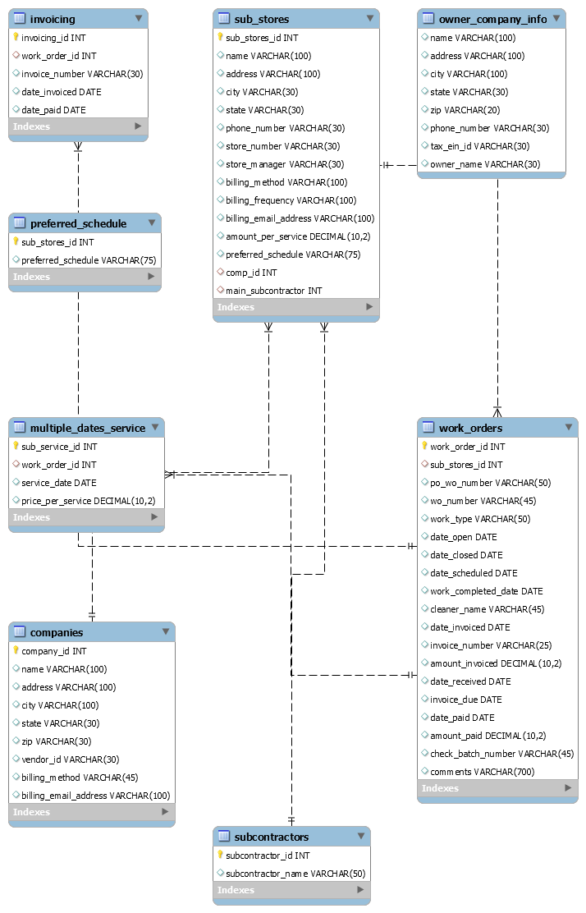

# cleanIt
A MySQL database I designed and built from scratch to run invoicing
for a real janitorial services business. It managed client companies,
their individual store locations, subcontractors, service schedules,
and work orders, and generated the data behind every invoice the
business sent.

All data in this export has been fully anonymized. Names, addresses,
phone numbers, emails, and tax IDs are placeholders; the structure
and volume reflect real business history.

## What it tracked

- **8 tables**: companies, sub_stores, subcontractors, work_orders,
  invoicing, multiple_dates_service, preferred_schedule,
  owner_company_info
- **342 work orders** across ~95 store locations
- Parent companies with many individual store locations (one client
  chain could have dozens of stores, each with its own manager,
  schedule, and billing)

## The invoicing pipeline

This wasn't just a database; it was a working billing system:

1. **MySQL** stored all clients, stores, schedules, and work orders
2. **Microsoft Access** connected to MySQL through an ODBC connector
   for data entry and reporting
3. **Excel** received exported data to produce the final client
   invoices

## Sample queries

Count of work orders in the system:

    SELECT COUNT(*) AS total_work_orders FROM work_orders;

Store locations with their managers and billing contacts:

    SELECT name, store_number, store_manager, billing_email_address
    FROM sub_stores
    ORDER BY name;

## Background

I built this while teaching myself SQL, applying training in
Microsoft Access from my associate's degree. Every design decision
came from a real business need: how stores roll up to parent
companies, how recurring schedules generate work orders, and how
completed work becomes an invoice.

## How to use

Import `janitorial_invoicing.sql` into MySQL 8.0+:

    mysql -u root -p < janitorial_invoicing.sql
0
